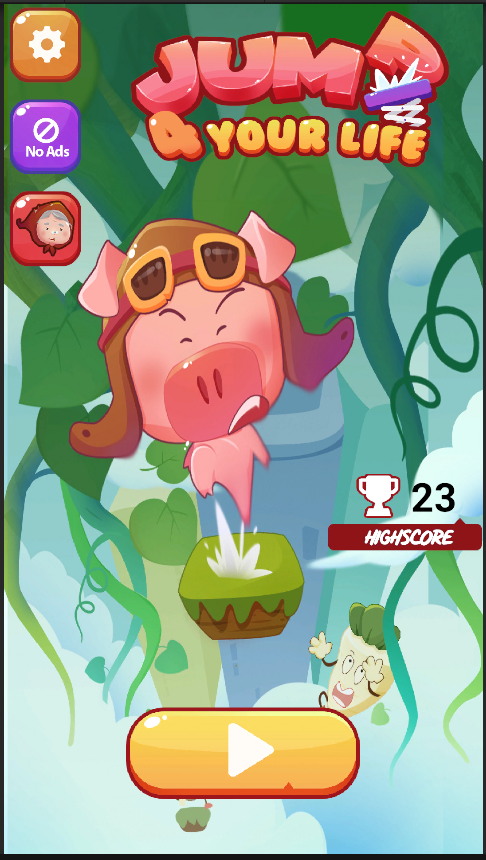
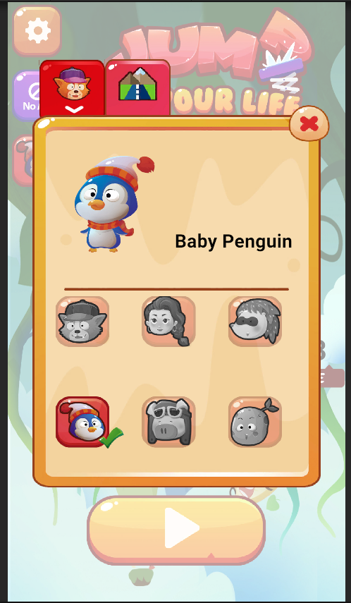
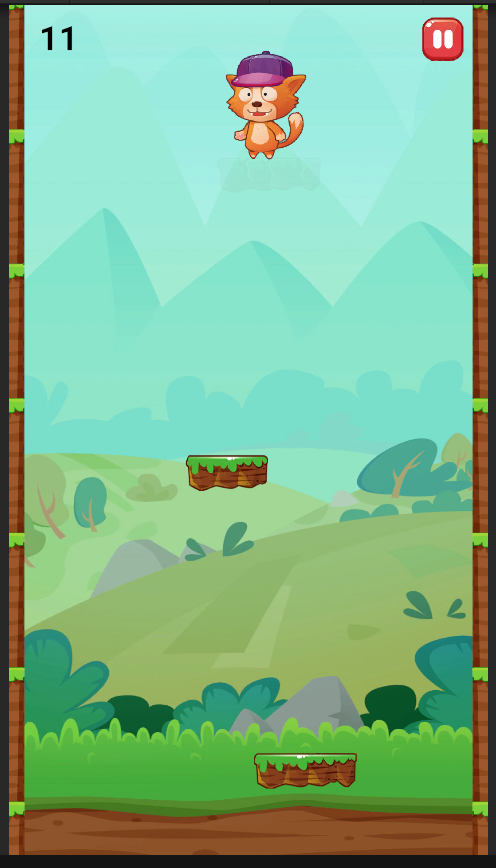
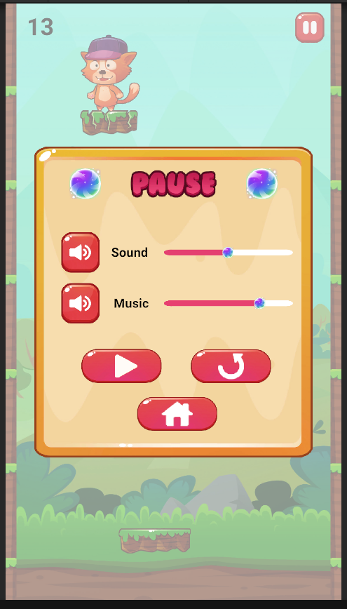

# Game Unity 2D
## 1. Thông Tin
##### **Tên Game:** JumpForYourLife
##### **Thành viên:** [Phan Thanh Tân](https://github.com/TanaKeKe?fbclid=IwY2xjawG2F6tleHRuA2FlbQIxMAABHdk8g-46_QxlPnvj-EI7KAKM6_auWOZQyAn44Gmicc8MSRO7uH80lW61ug_aem_YiPfD4achhN8eAa2vGZNbw)
##### **Cố Vấn:** [Nguyễn Tiến Hùng](https://github.com/NgTienHungg?fbclid=IwY2xjawG2F4RleHRuA2FlbQIxMAABHTgbFw5NUG5aoYjEB1GtZ2StL6Am77yeAked5MnfSeTgqtKLFYzXrLmiDQ_aem_qg2IxJtLmAHKE8WVl6fJOg)
##### **Link Tải Game và Video demo:** [JumpForYourLife]()
### Version Control Strategy

Dựa trên Gitflow để quản lý code, cụ thể là sử dụng phần mềm **Fork**. Gồm 4 nhánh main, develop, review, backup.
- Các nhánh chính:
  - `main`: Chứa code ổn định, đã qua kiểm tra và test kỹ lưỡng
  - `develop`: Chứa code mới nhất, đã qua review và test
  - `review`: Nhánh để review code của cố vấn.
  - `backup`: Nhánh để phòng trừ trường hợp xóa nhầm hay mất 1 số thành phần không mong muốn xảy ra, cùng cấp với develop.
- Luồng hoạt động gitflow: code trong nhánh develop, xin nhận xét từ nhánh `review` rồi merge vào `develop`. Sau khi ổn định thì rebase nhánh `backup` lên `develop` rồi test kĩ lưỡng và merge `develop` vào `main`.

## 2. Giới Thiệu Game

**JumpForYourLife** là 1 game giải trí, giúp thư giãn sau những giờ học căng thẳng với những nhân vật vô tri hài hước.

## 3. Các Chức Năng Chính
- Skinshop: player and theme.
- SoundController: audio mixer, slider
- Cơ chế hoạt động: jump to block.
- Các block đặc biệt: dễ, trung bình, khó, tàng hình, tăng tốc và trộn các hình thức lại với nhau tới 1 ngưỡng điểm nhất định.

## 4. Công Nghệ Sử Dụng
- Unity Engine
- Design pattern: obsever pattern, Singleton.
- Dotween

## 5. Hình ảnh demo

## 6. Các Vấn Đề Gặp Phải

#### Vấn Đề 1: Kiểm tra va chạm
**Vấn đề:** Việc kiểm tra va chạm giữa nhân vật với block, block với wall đôi khi gặp 1 số vấn đề mỗi lần chuyển trạng thái camera như
- Va chạm 2 lần trong tíc tắc
- Collider chưa khít
- Bị chồng collider biến việc va chạm thành 2 lần
- Mỗi lần nhân vật nhảy thì việc xử lí va chạm cũng quan trọng vì phải thay đổi isTrigger liên tục. 

**Giải pháp:** 
- Chỉnh lại collider cho khít. Hạn chế chồng collider bằng cách chỉnh tọa độ.
- Tạo thêm biến có chức năng kiểm tra lúc nào nhân vật chuyển state và đánh dấu các khối block cho dễ kiểm soát

#### Vấn Đề 2: Camera
**Vấn đề** Mỗi lần chuyển state của nhân vật và chạm 1 khối khác thì camera phải di chuyển theo nhưng camera hoạt động chưa đúng ý muốn.

**Giải pháp:** Kiểm soát độ dịch camera theo khoảng cách nhảy.

#### Vấn Đề 3: Việc sinh ra block
**Vấn đề:** Việc sinh ra quá nhiều block không cần thiết gây tốn bộ nhớ.

**Giải pháp:** Sử dụng objectPool để chứa 1 lượng vừa đủ block, lấy ra dùng lại hợp lí.

## 7. Kết Luận

**Kết quả đạt được:** Game đã giúp học được rất nhiều thứ cả về engine Unity và cả tư duy về cách làm game.

**Hướng phát triển tiếp theo:** 
- Tạo thêm nhân vật, theme.
- Thêm các loại block mới: đi ziczac lên xuống, dịch chuyển...
- Thêm các loại hiệu ứng mới như: nhảy 2 bậc liên tục, 3 bậc liên tục, popup...
- Thêm chức năng unlock nhân vật, ăn tiền vàng để mở nhân vật, theme.
- Thêm các quyền trợ giúp như: giúp block dài ra, bất tử với thời gian nhất định, ...
